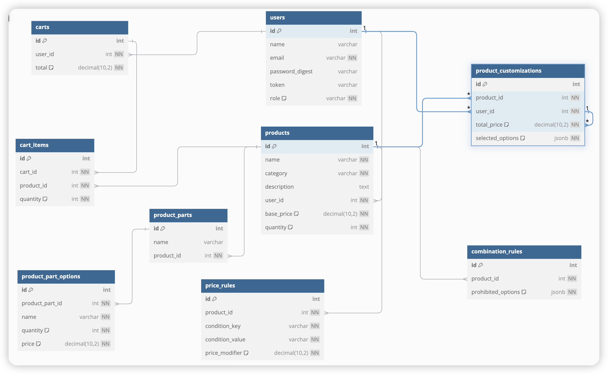

# A website for bicycle shop and beyond

In this project I built a website for a bicycle shop, the site is scaled to also handle the sale of other items like:
skis, surfboards, roller skates, or other related sport items.

# Technologies

- React
- TypeScript
- Scss
- Ruby on Rails
- postgresql

# Features

- Register
- Login
- Product page
- Add to cart action
- New product creation
- Adding a new part choice
- Setting prices

# Workflows

This project has two main workflows, one for user with role admin, and the other for any customer who visits the page.
Per the requirement, the Owner of the site, Marcus would be perform administrative duties, and these duties include managing the website by adding adding and removing products
from the website.
The addition of products to the website follows 4 steps, namely: Adding the product details, adding the various part of the website, adding the options available for each part,
Adding a price rule for dynamic pricing, adding a combination rule for restricted or prohibited combinations. 
Each of the steps mentioned are each capture by a unique entities, thus, ensuring flexibility and modularity. The details of the entities would be outlined in the data models
section.
The Admin can also remove product he no longer want based on his own discretion.
Customer on the other hand can browse to product, customize if the want and add their product of choice to their cart.

# Main user actions

Admin: Create product, add part, add part options, set price rule, set combination rule and remove product from website.
Each product has a base price, which is determine by the part options specify by the admin, currently the price of each part sum up to the base price of the product.
Each product have their own price rule to enable dynamic pricing as specify in the requirement, this also set by admin at the creation of the product.
Each product have their own part combination rule, which determine which combinations are valid or otherwise.

Customer: Browse through product, customize product and add product to cart by clicking add to cart button.
The price of a product is based on the customization of made by the customer. The customer may also add a product to their cart without customization.
User can then view all the products added to their cart, by clicking the dropdown menu in the profile image or name.
User can also remove specific product from their cart.

# Product Page
This page is based on my own imagination. The product page display all the products created by the admin. Since this is a demo, some of the products are generated from seeding.

# Add to cart action
User may customize a product and click on the "Add to cart" button to add cart or may not customize at all before adding to cart.

# How to start the application

clone the application to your local machine.

`
git clone git@github.com:Forison/bikeShop.git
`

The application is made up of two directory(parts) the backend and the frontend.
Open two tabs in your terminal, one tab should point to the backend and the other to frontend

Tab 1(frontend)
`
cd frontend
`

install the dependencies by running

`
yarn install
`

Make sure you have a .env file inside the frontend dir
Add
`
REACT_APP_BACK_END_API_URL=http://localhost:{port}
`

then start the frontend by running

`
yarn start
`

Tab 2(backend)
`
cd backend
`
install the dependencies by running

`
bundle or bundle install
`
create the database 

`
rails db:create
`

Add migration by running

`
rails db:migrate
`

now start the backend by running

`
rails s --port={port_number}
`
Also run the test by running the command

`
rails test
`
# Model Section

